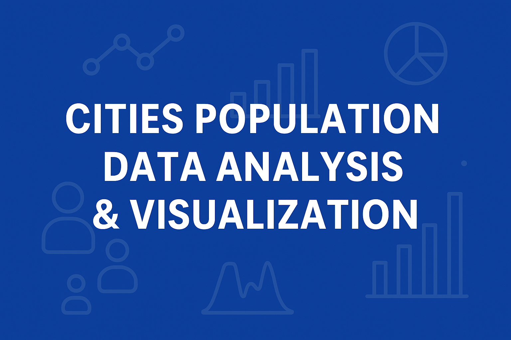
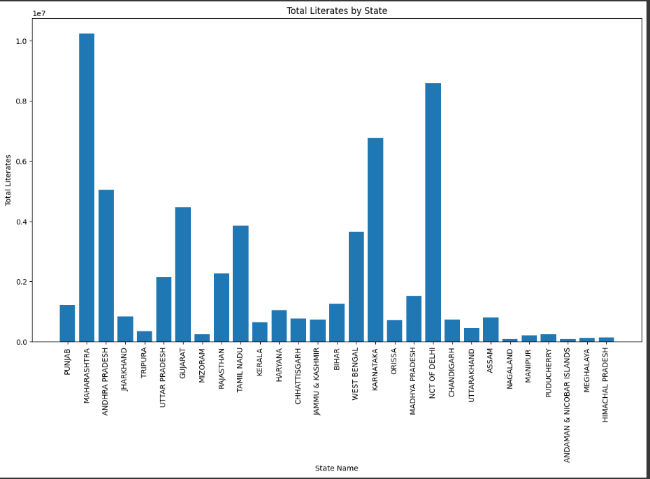

  

# 📊 Cities Population Data Analysis & Visualization  

> **Turning raw population data into powerful insights** with Pandas, NumPy, Matplotlib, Seaborn, and Streamlit.  

This project analyzes Indian city-level data on **population, literacy, and gender ratios** to create meaningful **statistical insights** and **beautiful visualizations**.  

---

## 🚀 Features  

✅ **Data Cleaning & Preprocessing**  
- Removed unnecessary columns (`child_sex_ratio`)  
- Sorted dataset alphabetically by states  
- Added calculated fields: **Sex Ratio** and **Effective Literacy Rate**  

📊 **Data Visualizations**  
- **Bar Charts** – Literacy comparison across states  
- **Scatter Plots** – Graduates vs Literacy Rate correlation  
- **KDE Plots** – Literacy distribution patterns by state  
- **Bubble Plots** – Population vs Literacy Rate with graduation size mapping  
- **Heatmaps** – Gender ratio visualization in top populated states  
- **Multi-Plot Dashboards** – Four insights in a single view  

🖥 **Interactive Streamlit App** *(optional)*  
- Upload dataset interactively  
- Render plots dynamically  

---

## 📂 Dataset  

**File:** `cities_r2.csv`  
**Contains:**  
- State & City details  
- Population (Male/Female/Total)  
- Literacy & Graduation stats  
- Derived Ratios for deep analysis  

---

## 📸 Visual Samples  

### 📦 Total Literates by State  
  

### 🎯 Graduates vs Literacy Rate  
  

### 🌈 Literacy Distribution by State (KDE Plot)  
  

### 🔥 Male vs Female Population Heatmap  
  

---

## 🛠️ Tech Stack  

| Tool        | Purpose |
|-------------|---------|
| **Python**  | Core programming |
| **Pandas**  | Data manipulation |
| **NumPy**   | Numerical operations |
| **Matplotlib** | Data visualization |
| **Seaborn** | Statistical plots |
| **Streamlit** | Interactive dashboards |

---

